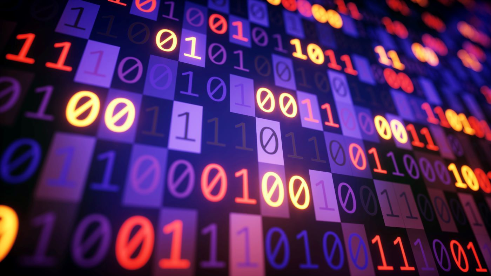

# Connecting two hosts

Esta seção apresenta algumas explicações complementares para questões que podem surgir durante a leitura.

## O que é informação?

Vídeos, imagens, músicas, páginas da Internet e outros conteúdos digitais são armazenados e processados como **dados digitais**, que podem ser representados por sequências de *bits*.



### O que são bits?

O **bit** (*binary digit*) é a menor unidade de informação digital e pode assumir dois valores: **0 ou 1**. Esses dois valores podem ser utilizados para representar diferentes estados ou, quando combinados em sequências, representar informações mais complexas.

Um bit isolado possui apenas duas possibilidades. Entretanto, vários bits podem ser agrupados para representar números, caracteres, imagens, áudio, instruções de programas e outros tipos de dados.

Para visualizar isso de maneira simples, imagine que queremos enviar o caractere **"A"** de um computador para outro. Em uma codificação como o **ASCII**, esse caractere pode ser representado pela sequência:

```text
01000001 = A
```

Cada `0` ou `1` corresponde a um bit. Nesse caso, são utilizados **8 bits**, formando **1 byte**, para representar o caractere `A`.

É importante observar que o computador não recebe literalmente a ideia abstrata de uma letra. Ele recebe uma sequência de bits, e uma determinada **codificação** define como essa sequência deve ser interpretada. No exemplo acima, a codificação ASCII estabelece que `01000001` representa o caractere `A`.

O mesmo princípio pode ser utilizado para representar informações muito maiores. Uma imagem, por exemplo, é formada por muitos dados referentes aos seus pixels e às características utilizadas para armazená-los. Um vídeo, por sua vez, pode conter milhões ou bilhões de bits, dependendo de sua duração, resolução, compressão e outros fatores.

Por isso, podemos pensar em uma informação digital como uma grande sequência de bits:

```text
A
↓
01000001
↓
8 bits
```

ou, para informações maiores:

```text
vídeo
↓
dados digitais
↓
uma grande sequência de bits
↓
transmissão pela rede
↓
outro computador
```

### Quantos bits são necessários?

Não existe uma quantidade fixa de bits para representar um determinado tipo de conteúdo. O tamanho depende de como os dados são codificados e armazenados.

Como exemplos aproximados de escala:

* **1 bit:** possui duas possibilidades, `0` ou `1`;
* **8 bits:** correspondem a **1 byte**;
* **1 KB:** aproximadamente mil bytes;
* **1 MB:** aproximadamente um milhão de bytes;
* **1 GB:** aproximadamente um bilhão de bytes.

Assim, um pequeno texto pode exigir poucos bytes, enquanto uma imagem, um áudio ou um vídeo pode exigir milhões ou bilhões de bytes. Além disso, técnicas de **compressão** podem reduzir significativamente a quantidade de dados necessária para representar determinado conteúdo.

O ponto importante para este capítulo não é determinar exatamente quantos bits existem em cada tipo de arquivo, mas perceber a escala do problema: **uma comunicação pela Internet pode envolver uma quantidade extremamente grande de bits sendo transportados continuamente entre diferentes computadores e redes.**

É justamente a partir dessa questão que surge a próxima pergunta:

> **Se tudo isso é representado por bits, como esses bits conseguem percorrer a Internet inteira sem simplesmente "congestionar" os cabos?**

Para responder a essa pergunta, precisamos deixar de observar apenas a informação individual e passar a observar a **infraestrutura que transporta grandes volumes de dados**.


- [Khan Academy: Binary & Data](https://www.khanacademy.org/computing/computers-and-internet/xcae6f4a7ff015e7d:digital-information/xcae6f4a7ff015e7d:bits-and-bytes/v/khan-academy-and-codeorg-binary-data)
- [How exactly does binary code work?](https://www.youtube.com/watch?v=wgbV6DLVezo)


## Como realmente a informação é transferida?

Intuitivamente, alguns questionamentos podem surgir ao observar como funciona a comunicação em redes de computadores. Afinal, acessar um conteúdo hospedado em outro continente pode parecer algo distante e pouco palpável. Algumas dessas questões são:

* **Como essa informação viaja?** Como posso acessar, em poucos instantes, um conteúdo que está armazenado em outro continente?
* **Como uma quantidade tão grande de informação é transmitida?** Um vídeo, por exemplo, pode representar milhões ou bilhões de bits, e diferentes usuários realizam transmissões simultaneamente.
* **Se os dados são transmitidos por cabos, por que eles não ficam congestionados?** Se todos esses bits precisam percorrer os mesmos enlaces, como a infraestrutura consegue suportar tamanha quantidade de tráfego?

Como apresentado no capítulo anterior, a informação pode ser transmitida por diferentes meios físicos, como cabos elétricos, fibras ópticas e ondas de rádio. Entretanto, observar apenas o meio físico não é suficiente para compreender como a Internet consegue transportar dados em escala mundial. É necessário observar como esses diferentes meios são organizados e quais tecnologias permitem que grandes quantidades de dados sejam transportadas simultaneamente.

Para visualizar essa estrutura, utilizaremos a analogia da **Cachoeira Perpétua**. A ideia é imaginar que os dados percorrem uma sequência de ambientes cada vez menores, desde a comunicação entre continentes até o dispositivo do usuário.

A analogia é dividida em quatro etapas:

1. **Topo:** a borda da cachoeira, de onde a água começa a despencar. Representa a comunicação entre grandes regiões do mundo, principalmente por meio de cabos submarinos de fibra óptica.

2. **Queda:** o trecho em que a água despenca continuamente. Representa o transporte de dados em grandes distâncias dentro de um país, por meio das redes de backbone e seus enlaces de alta capacidade.

3. **Base:** o ponto em que a água atinge o solo, perde parte de sua velocidade e começa a se espalhar. Representa a distribuição dos dados em escalas regionais e metropolitanas, aproximando o tráfego do local onde está o usuário.

4. **Leito:** o trecho em que a água finalmente se torna calma e acessível. Representa a rede de acesso, responsável por conectar o usuário à Internet e entregar os dados ao seu dispositivo.

Para compreender essa analogia, serão utilizadas algumas nomenclaturas técnicas. Elas serão apresentadas de maneira simplificada, pois o objetivo não é aprofundar os mecanismos de baixo nível, mas compreender como diferentes tecnologias se complementam para transportar uma informação desde sua origem até o usuário.

### O que é o Topo?

A Internet conecta diferentes continentes, o que exige uma infraestrutura capaz de transportar enormes quantidades de dados através dos oceanos. Essa função é desempenhada principalmente por **cabos submarinos de fibra óptica**, que formam grandes enlaces entre diferentes regiões do mundo.

Nesses cabos, os dados são transportados por meio de **sinais ópticos**. Em vez de utilizar diretamente sinais elétricos para representar os bits ao longo de todo o enlace, transmissores ópticos convertem os dados em pulsos de luz que percorrem as fibras.

Entretanto, a capacidade desses enlaces não depende simplesmente de colocar uma grande quantidade de bits em uma única sequência. Uma mesma fibra pode transportar diversos canais ópticos simultaneamente por meio de técnicas de **multiplexação por divisão de comprimento de onda (WDM)**. Em sistemas de alta capacidade, utiliza-se uma forma mais densa dessa técnica, conhecida como **DWDM (Dense Wavelength Division Multiplexing)**.

Assim, diferentes sinais ópticos podem utilizar diferentes comprimentos de onda e compartilhar a mesma fibra. Isso permite que um único sistema de fibra transporte uma quantidade extremamente grande de dados simultaneamente. Portanto, não é simplesmente o comprimento do cabo que determina sua capacidade: a capacidade depende também das características da fibra, dos transmissores e receptores ópticos e, principalmente, das tecnologias utilizadas para multiplexar e transmitir os sinais.

Nesse ponto da cachoeira, portanto, estamos no **Topo**: grandes volumes de dados atravessam enormes distâncias para conectar diferentes partes do mundo.

### O que é a Queda?

Depois de chegar a um continente, os dados ainda podem precisar percorrer milhares de quilômetros até alcançar a região onde está o seu destino. Para isso, entram em ação as **redes de backbone**, responsáveis por transportar grandes volumes de tráfego entre diferentes regiões de um país.

Assim como ocorre nos cabos submarinos, esses enlaces utilizam principalmente **fibra óptica**. A diferença está no contexto em que ela é utilizada: enquanto os cabos submarinos realizam grandes conexões entre regiões separadas por oceanos, o backbone terrestre conecta grandes pontos da infraestrutura dentro de um território.

Nessa escala, também são utilizadas tecnologias de transmissão óptica de alta capacidade, incluindo **WDM/DWDM**, além de equipamentos responsáveis por encaminhar os dados entre diferentes enlaces. Os dados não percorrem necessariamente um único cabo diretamente até o destino. Eles passam por diferentes pontos da rede, nos quais equipamentos de encaminhamento determinam para onde o tráfego deve seguir.

A **Queda**, portanto, representa o transporte em longa distância dentro do país: os dados já deixaram a conexão intercontinental, mas ainda estão percorrendo a infraestrutura de grande escala que os aproxima da região onde o usuário está localizado.

### O que é a Base?

Depois de percorrer grandes distâncias pelo backbone nacional, o tráfego precisa ser distribuído para regiões cada vez menores. É nesse ponto que entramos na **Base** da cachoeira.

Aqui, a infraestrutura deixa de conectar apenas grandes centros e passa a conectar **regiões, estados, cidades e bairros**. Uma das tecnologias utilizadas nessa escala são as **redes metropolitanas (MAN — Metropolitan Area Network)**, que interligam diferentes pontos dentro de uma região geográfica limitada, como uma cidade ou área metropolitana.

A fibra óptica continua sendo amplamente utilizada, mas agora aparecem também equipamentos responsáveis pela **agregação e distribuição do tráfego**. Um grande volume de dados recebido da rede de backbone pode ser dividido entre diferentes enlaces, cada um direcionado para uma região ou conjunto de usuários.

Podemos imaginar esse processo como a água que atinge a base da cachoeira. Ela deixa de percorrer apenas um fluxo concentrado e começa a se espalhar por diferentes caminhos. Da mesma forma, os dados que chegaram por um enlace de grande capacidade são distribuídos para redes menores, aproximando-se progressivamente de seu destino.

A **Base**, portanto, representa a distribuição regional do tráfego: os dados já estão próximos da região onde o usuário está, mas ainda precisam percorrer a rede de acesso.

### O que é o Leito?

Finalmente, chegamos ao **Leito** da cachoeira. É a etapa em que os dados deixam as grandes redes de transporte e chegam à rede responsável por conectar diretamente o usuário.

Essa última etapa é chamada de **rede de acesso**. Dependendo do local e da tecnologia utilizada, essa conexão pode ocorrer por **fibra óptica até a residência (FTTH — Fiber To The Home)**, cabo, Ethernet ou redes sem fio, como **Wi-Fi e redes móveis 4G e 5G**.

No caso de uma conexão residencial por fibra, por exemplo, o tráfego pode sair da infraestrutura de transporte do provedor, passar pela rede de acesso e chegar ao equipamento instalado na residência. A partir dele, o usuário pode distribuir a conexão para seus dispositivos por Ethernet ou Wi-Fi.

É nesse ponto que a informação finalmente se torna acessível ao usuário. O vídeo solicitado, a página acessada ou a mensagem enviada percorreu uma longa cadeia de redes e equipamentos, mas agora os dados chegaram ao dispositivo que efetivamente os utilizará.

O **Leito**, portanto, representa a última etapa da jornada: a conexão entre a infraestrutura da Internet e o dispositivo do usuário.

- [How does the INTERNET work? | ICT #2](https://www.youtube.com/watch?v=x3c1ih2NJEg&)

# Exemplos do Capítulo

